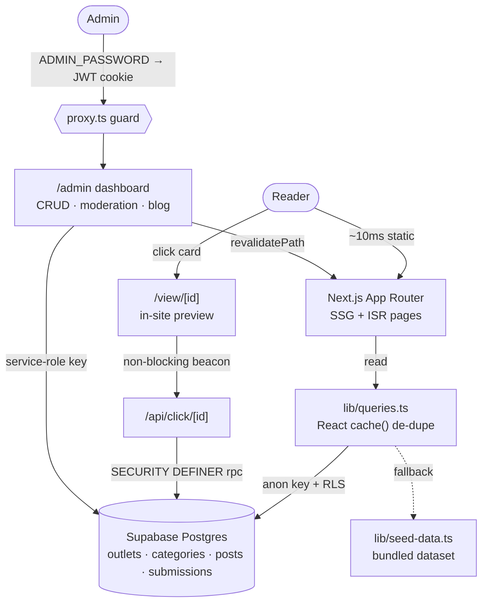

<div align="center">

# 📰 AllNewspaperBangla

### The fastest, most complete directory of Bangla media on the web.

Every national daily, online portal, TV & FM channel, ePaper, government site, job board and regional newspaper — **organised, searchable, and one tap away.**

<br/>


</div>

---

## ✨ Why it's different

Most Bangla newspaper directories are cluttered, ad-heavy, and bounce you off to a third-party site on every click. **AllNewspaperBangla** is a premium, editorial-grade index built for speed and control:

- ⚡ **Lightspeed.** Every public page is statically pre-rendered (ISR) and served in **~10 ms** — no spinner, no wait.
- 🖼️ **Read on-site.** Outlets open in an **in-site viewer** with a live preview — the reader stays on *your* domain. Sites that block embedding can be flipped to **one-click direct open**.
- 🎨 **Genuinely premium.** Warm editorial canvas, crisp square logo tiles, real brand favicons, one confident red accent — not a template.
- 🔤 **Bangla Converter.** Phonetic English→বাংলা typing, Bijoy ⇌ Unicode, and English ⇌ Bangla digits — 100% in the browser.
- 🛠️ **Full admin.** A secret, password-gated dashboard to manage every outlet, category, submission and blog post — with logo uploads and live click analytics.
- 📈 **Click tracking.** Non-blocking beacon counts every open without ever slowing a page.

---

## 🚀 Performance

Real TTFB from a production build (`next start`), served as static HTML:

| Route | Rendering | TTFB |
| :--- | :--- | ---: |
| `/` Home | Static + ISR | **~12 ms** |
| `/category/[slug]` | SSG (18 pages) | **~9 ms** |
| `/local/[division]` | SSG (8 pages) | **~13 ms** |
| `/view/[id]` Outlet viewer | SSG (158 pages) | **~16 ms** *(4 ms cached)* |
| `/converter` | Static | **~12 ms** |

> The outlet viewer was refactored from a per-request database round-trip (**478 ms**) to fully pre-rendered SSG — a **~30× speed-up** — while click counting moved to a fire-and-forget client beacon so nothing blocks render.

---

## 🧭 Architecture



---

## 🧩 Feature matrix

| Area | What you get |
| :--- | :--- |
| **Directory** | 158+ outlets across 19 categories, live hero search, per-category filter |
| **TV & Radio** | Somoy, Jamuna, Channel 24, NTV, Channel i… + top FM stations |
| **Regional** | All 8 divisions (Dhaka → Barisal) with dedicated pages |
| **Viewer** | On-site live preview + graceful "open full site" fallback |
| **Converter** | Phonetic typing · Bijoy⇌Unicode · Bangla digits |
| **Submit a Site** | Public form → moderation queue (honeypot + validation) |
| **Blog** | Markdown posts authored from the admin |
| **Admin** | Env-password login, outlets/categories CRUD, submissions, blog, logo upload, click stats |
| **SEO** | Dynamic `sitemap.xml`, `robots.txt`, Open Graph, per-page metadata |

---

## 🏁 Quick start

```bash
git clone https://github.com/faizasurma66-max/BANGLA_NEWS.git
cd BANGLA_NEWS
npm install
cp .env.example .env.local     # fill in values (see below)
npm run dev                    # http://localhost:4317
```

> 💡 **Runs with zero config.** Without Supabase, the site serves ~158 outlets from a bundled dataset so you can develop and preview instantly. Connect Supabase to unlock editing, submissions and click tracking.

---

## 🔑 Environment variables

| Variable | Required | Purpose |
| :--- | :--- | :--- |
| `NEXT_PUBLIC_SITE_URL` | recommended | Canonical URL for metadata / sitemap |
| `NEXT_PUBLIC_SUPABASE_URL` | for DB | Supabase project URL |
| `NEXT_PUBLIC_SUPABASE_ANON_KEY` | for DB | Public anon key (reads + click RPC) |
| `SUPABASE_SERVICE_ROLE_KEY` | for writes | **Server-only** — admin writes & submissions |
| `ADMIN_PASSWORD` | for admin | The secret `/admin` login password |
| `ADMIN_SESSION_SECRET` | for admin | Long random string that signs the session cookie |

Server-only secrets are **never** exposed to the browser.

---

## 🗄️ Connect Supabase

1. Create a project at [supabase.com](https://supabase.com).
2. **SQL Editor → New query** → run [`supabase/schema.sql`](supabase/schema.sql) (tables, indexes, click RPC, RLS, `logos` bucket).
3. Run [`supabase/seed.sql`](supabase/seed.sql) to load categories + ~158 outlets.
4. **Settings → API** → copy the URL, `anon` and `service_role` keys into `.env.local`.

Regenerate the seed after editing [`lib/seed-data.ts`](lib/seed-data.ts):

```bash
npx tsx scripts/gen-seed.ts
```

---

## 🔐 Admin panel

- Visit **`/admin`** → redirected to `/admin/login`.
- Enter `ADMIN_PASSWORD` → a signed, httpOnly session cookie is set (7 days).
- Manage outlets, categories, submissions and blog posts; upload logos; watch click counts.
- Every `/admin/*` route is guarded by the root [`proxy.ts`](proxy.ts).

---

## ☁️ Deploy (Vercel)

1. Import this repo into [Vercel](https://vercel.com).
2. Add every variable from the table above (use a **strong** `ADMIN_PASSWORD` and set `NEXT_PUBLIC_SITE_URL` to your domain).
3. Deploy. Pages are ISR-cached; admin writes revalidate them instantly.

---

## 🧱 Project structure

```
app/
  (site)/            Public pages (shared header/footer chrome)
    page.tsx         Home
    category/[slug]  Category listing        + loading.tsx skeleton
    local/[division] Division newspapers     + loading.tsx skeleton
    view/[id]        In-site outlet viewer   + loading.tsx skeleton
    epaper · blog · converter · submit
  admin/
    login/           Password login (public)
    (protected)/     Guarded dashboard + CRUD
  api/click/[id]     Non-blocking click beacon
  go/[id]            Tracked external redirect
  sitemap.ts · robots.ts
components/site/      Header, footer, cards, grids, search, skeletons, viewer bits
components/admin/     Admin shell + forms
components/converter/ Bangla Converter tool
lib/
  seed-data.ts       Canonical dataset (fallback + seed source)
  queries.ts         Public reads (DB → seed fallback, React cache())
  admin-queries.ts   Service-role reads for admin
  actions/           Server actions (auth · submit · admin CRUD)
  auth.ts · auth-token.ts · bangla.ts · validation.ts
supabase/            schema.sql · seed.sql · migrations/
proxy.ts             Admin route guard
```

---

## 🛠️ Tech stack

**Next.js 16** (App Router, RSC, SSG/ISR) · **React 19** · **TypeScript** · **Tailwind CSS v4** · **Supabase** (Postgres + Storage + RLS) · **jose** (JWT sessions) · **zod** (validation) · **react-markdown** · **lucide-react**

---

## 🗺️ Roadmap

- [ ] Global "open external by default" override toggle
- [ ] Per-outlet analytics dashboard (clicks over time)
- [ ] Reader mode for embed-blocking publishers
- [ ] Bengali UI localisation
- [ ] PWA / offline directory

---

## 📝 Notes

- Outlet logos default to **real brand favicons** with a tinted monogram fallback — upload custom logos anytime in the admin.
- Outlet URLs are best-effort and fully editable in the admin.
- The Bijoy⇌Unicode converter is **beta**; phonetic and digit conversion are exact.

---

<div align="center">

**Built with care for the Bengali-speaking web.** 🇧🇩

</div>
